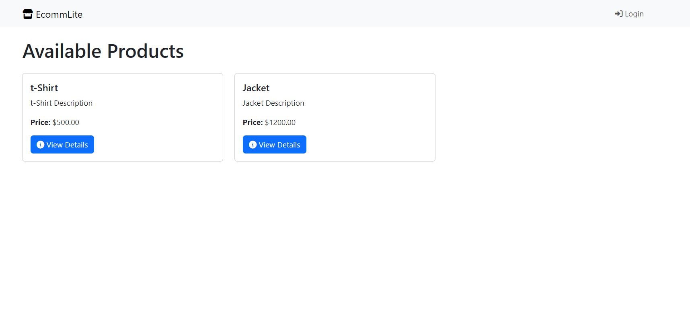
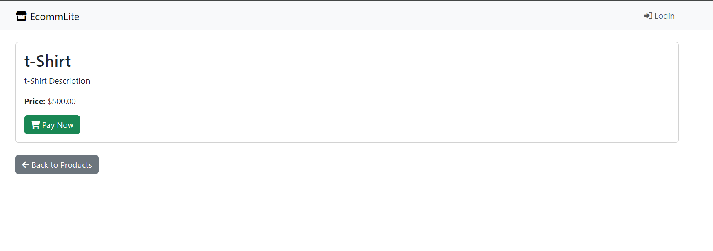
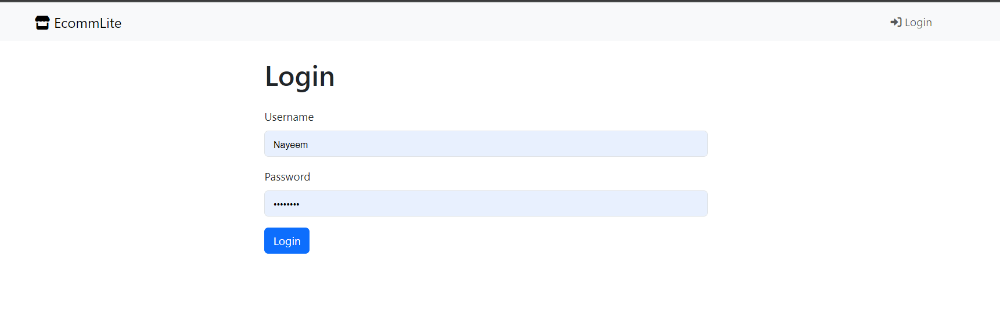
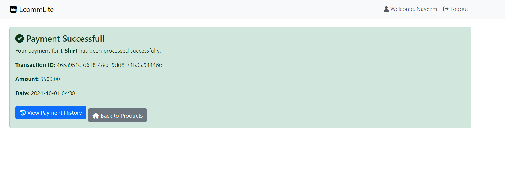
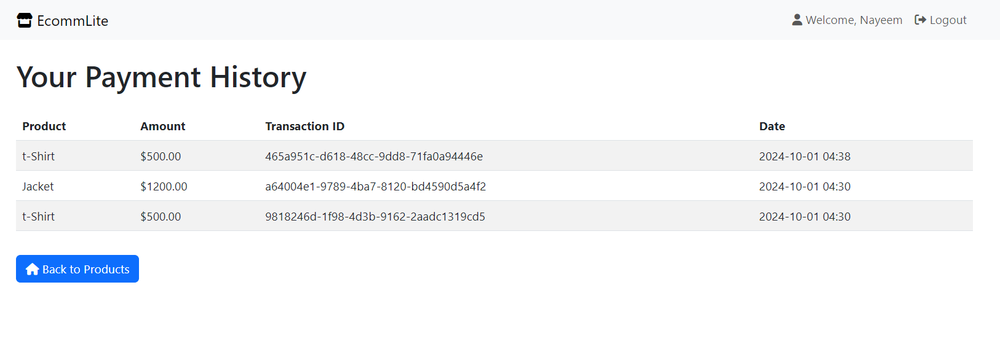
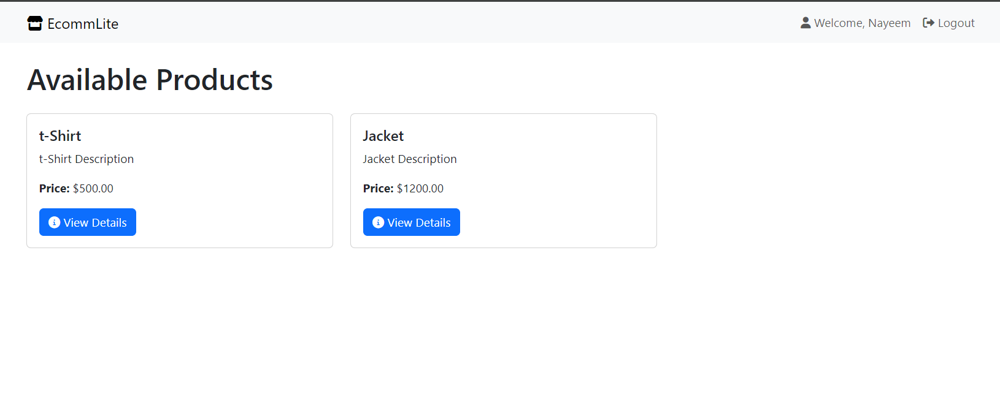

# EcommLite

EcommLite is a minimal e-commerce platform built using Django and FastAPI, with a focus on an event-driven architecture using Redis for communication between services. This platform allows users to browse products, process payments, and view payment history.

## Project Structure

```
EcommLite_platform/
│
├── payment_gateway/         # FastAPI app for processing payments
├── usermanagement/          # Django app for user management and product display
├── venv/                    # Python virtual environment
├── screenshots/             # Screenshots folder for project visuals
└── README.md                # Project README file
```

## Features

- Product list and product details accessible without login.
- Payment processing using event-driven architecture via Redis.
- Payment history for logged-in users.
- Logout functionality with redirection to the product list.
- Bootstrap 5.3 used for responsive and user-friendly design.

## How to Run

### Step 1: Set up the environment

Clone the repository and navigate to the project root:

```bash
git clone https://github.com/NoManNayeem/EcommLite.git
cd EcommLite_platform
```

### Step 2: Set up virtual environment

```bash
python -m venv venv
source venv/bin/activate   # On Windows: venv\Scripts\activate
```

### Step 3: Install dependencies

Install the necessary dependencies:

```bash
pip install -r requirements.txt
```

### Step 4: Apply migrations

Navigate to the `usermanagement/` directory and apply the database migrations:

```bash
cd usermanagement
python manage.py migrate
```

### Step 5: Run Django and FastAPI

In one terminal, start the Django development server:

```bash
python manage.py runserver
```

In another terminal, start the FastAPI app from the `payment_gateway` directory:

```bash
cd ../payment_gateway
uvicorn main:app --reload --port 8001
```

### Step 6: Redis Setup

Ensure Redis is running on your system. You can start Redis using:

```bash
redis-server
```

### Step 7: Run the Redis worker for background tasks

Navigate to the `usermanagement/` directory and run the Redis worker:

```bash
python manage.py rqworker default
```

## Screenshots

Below are the screenshots showing the main features of the application.

<div style="display: grid; grid-template-columns: repeat(auto-fit, minmax(300px, 1fr)); gap: 20px;">








</div>

All screenshots are stored in the `screenshots/` folder.


## Technologies Used

- **Django**: For user management, product listing, and payment history.
- **FastAPI**: For handling payment processing.
- **Redis**: For event-driven communication between Django and FastAPI.
- **Bootstrap 5.3**: For responsive and modern UI design.

## License

This project is licensed under the MIT License.
